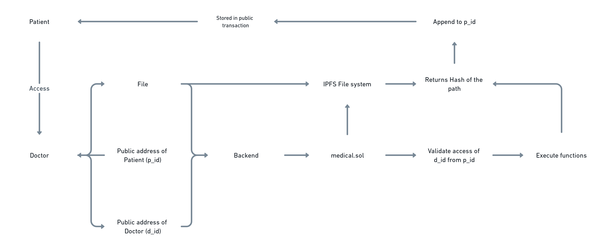
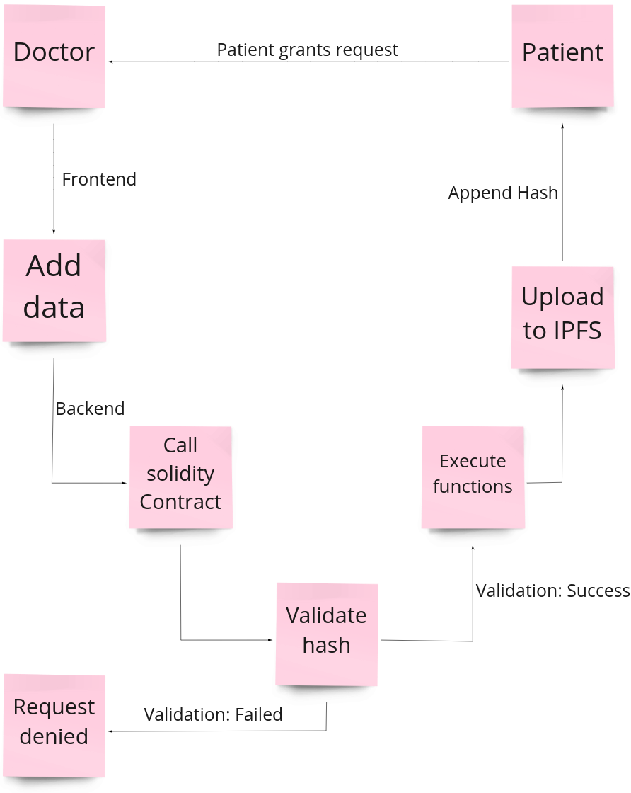

# Medygon 👾

This project was a part of Ingenious Hackathon 3.0

## Overview
- Blockchain-based medical records on Polygon's Matic network 
- Medygon solves the problem of tampering with medical records through blockchain's immutability.
- Currently, Doctors and Patients are the stakeholders considered in the transaction.
- Initially, the Patient grants access to the Doctor.
- Only after that, the Doctor can view the patient in his/her list and add documents for that Patient.
- The uploaded report can be viewed by the Patient - and each upload is identified by the Doctor's public key.

## Pre-requisities

Node, npm, Truffle, Ganache, React, Metamask
## Tech Stack

**Polygon:** Ethereum sidechain to store the records

**Solidity:** To write smart contracts

**Truffle:** Compiling .sol files

**Ganache:** Personal local blockchain

**IPFS:**  distributed hypermedia protocol

**React:** Client facing website

## Architecture

## Processes

## Demo

Insert gif or link to demo


## Run Locally

#### Clone the project

```bash
  git clone https://kutt.it/medygon
```
### Ganache
- Open the Ganache desktop client 
- Under Server tab:
    - Set Hostname to 127.0.0.1 -lo
    - Set Port Number to 8545
    - Enable Automine
- Under Accounts & Keys tab:
    - Enable Autogenerate HD Mnemonic
### IPFS
- Fire up your terminal and run `ipfs init`
```bash
  ipfs config --json API.HTTPHeaders.Access-Control-Allow-Origin '["*"]'
  ipfs config --json API.HTTPHeaders.Access-Control-Allow-Credentials '["true"]'
  ipfs config --json API.HTTPHeaders.Access-Control-Allow-Methods '["PUT", "POST", "GET"]'
```
### Truffle 
```
  npm install -g truffle
  truffle compile
  truffle migrate --network matic
```
### Running the DApp
* Connect Metamask to `localhost:8485`

Install dependencies

```bash
  npm i
```

Start the server

```bash
  npm start
```
* Open `localhost:3000`
## Authors

- [Parth Shah](https://www.github.com/parthmshah1302)
- [Malav Doshi](https://www.github.com/malav312)
- [Sameep Vani](https://www.github.com/Sameep1234)
- [Samkit Kundalia](https://www.github.com/samkitk)


## License

[MIT](https://choosealicense.com/licenses/mit/)

